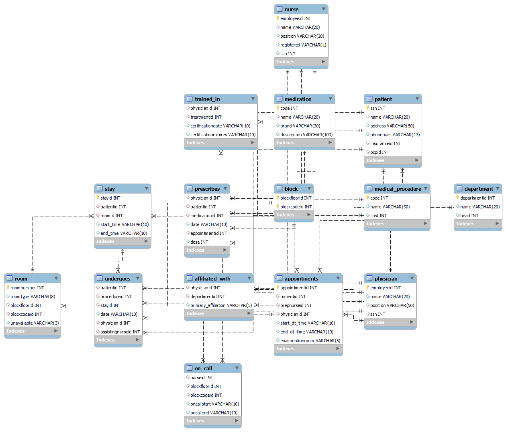

# 🏥 Hospital Database Management System  

Welcome to the **Hospital Database Management System (HDBMS)** repository! 🚑 This project defines a relational database designed to manage and streamline various aspects of a healthcare facility efficiently.  

---

## ✨ Features  

The database schema includes a comprehensive structure to manage critical hospital operations:  

### 1️⃣ **👩‍⚕️ Physicians**  
- 📋 **Details stored**:  
  - 🆔 Employee ID  
  - 👤 Name  
  - 🩺 Position  
  - 🔒 Social Security Number (SSN)  

### 2️⃣ **🏢 Departments**  
- 📋 **Details stored**:  
  - 🆔 Department ID  
  - 🏷️ Name  
  - 👨‍⚕️ Head of the Department  

### 3️⃣ **⚕️ Medical Procedures**  
- 📋 **Details stored**:  
  - 🆔 Procedure Code  
  - 💉 Procedure Name  
  - 💵 Cost  

### 4️⃣ **👨‍👩‍👦 Patients**  
- 📋 **Details stored**:  
  - 🔒 Social Security Number (SSN)  
  - 👤 Name  
  - 📍 Address  
  - 📞 Phone Number  
  - 💳 Insurance ID  
  - 🩺 Primary Care Physician (PCP)  

### 5️⃣ **👩‍⚕️ Nurses**  
- 📋 **Details stored**:  
  - 🆔 Employee ID  
  - 👤 Name  
  - 🩺 Position  
  - ✅ Registration Status  
  - 🔒 Social Security Number (SSN)  

### 6️⃣ **📅 Appointments**  
- 📋 **Details stored**:  
  - 🆔 Appointment ID  
  - 👨‍👩‍👦 Patient  
  - 👩‍⚕️ Preparing Nurse  
  - 🩺 Physician  
  - 🕒 Start & End Date/Time  
  - 🚪 Examination Room  

### 7️⃣ **💊 Medications**  
- 📋 **Details stored**:  
  - 🆔 Medication Code  
  - 💊 Name  
  - 🏷️ Brand  
  - 📝 Description  

### 8️⃣ **🚪 Rooms**  
- 📋 **Details stored**:  
  - 🏷️ Room Number  
  - 🛏️ Room Type  
  - 🏢 Block Floor  
  - 🔢 Block Code  
  - 🟢 Availability Status  

### 9️⃣ **🏗️ Blocks**  
- 📋 **Details stored**:  
  - 🏢 Block Floor  
  - 🔢 Block Code  

---

## 💡 Why Do We Need It?  

A healthcare management system is critical for efficiently organizing and managing various aspects of healthcare delivery. The **Hospital Database Management System** offers the following benefits:  

1. **🚀 Streamlined Administration**  
   Automates tasks like appointment scheduling, room assignments, and medication management.  

2. **💖 Enhanced Patient Care**  
   Provides quick access to accurate patient information and personalized treatment plans.  

3. **📜 Regulatory Compliance**  
   Ensures proper record maintenance and documentation.  

4. **📊 Operational Efficiency**  
   Optimizes resource allocation and improves decision-making using data-driven insights.  

---

## 📈 ER Diagram  

Below is the **ER Diagram** that represents the database schema for the system:  

  

  

---

## 🔑 Summary  

The SQL script defines the schema for a **Hospital Database Management System**, enabling efficient management of patient care and administrative processes within a healthcare facility. It ensures streamlined workflows and improved operational efficiency.  

---
